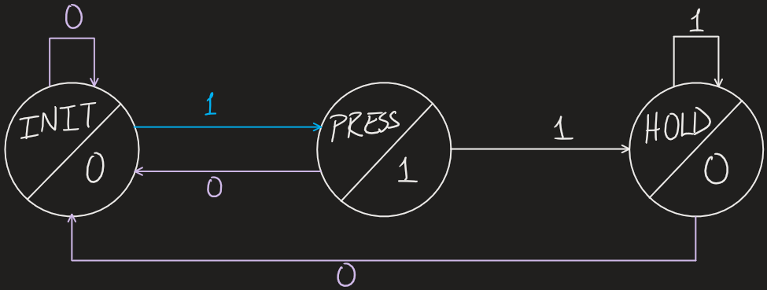

# Combination Lock FSM

This is a design for a simple combination lock written in Verilog using a Moore Finite State Machine, for *Lab 4* of
McMaster University's **Software Engineering 2DA4** course.

This repository includes the necessary Verilog code required for the circuit implementation, as well as a detailed
explanation of the design, which is explained below. Note that the code was written for use with an _Altera DE1-SoC_
board, and follows its specifications with respect to switches, push-buttons and 7-segment displays.

## Design Specifications

### I/O Specifications

* 4 switches implementing a 4-bit binary code key used to unlock the device
    * Read left-to-right
    * If 2 successive mismatches occur, the lock enters an alarm state that can only be exited by resetting the device
* 3 push-button inputs:
    * **Enter** (implemented as active HIGH)
    * **Change** (implemented as active HIGH)
    * **Reset** (implemented as active LOW)
* All push-button inputs are _conditioned_
    * Input conditioning must also be implemented as a sub-circuit
* Hexadecimal display to show the state of the lock
* Device runs on a 50 MHz clock
* It is assumed that only one button is pressed at a time

### Functional Specifications

* Lock starts in a neutral **_initial_** _locked_ state
    * The hexadecimal display outputs `-`
    * The lock code is set to `0110`
* Switches are manipulated to make a code combination
* When **Enter** is pressed, the combination is checked for a match. If a match occurs then:
    * The lock enters the _open_ state
    * The hexadecimal display outputs `O`
    * Lock stays in _open_ state until **Enter** is pressed again, after which it returns to the _locked_ state
* When **Change** is pressed, the code is checked for a match. If a match occurs then:
    * The lock enters the _new_ state
    * The hexadecimal output displays `n`
    * The lock remains in the _new_ state until **Change** or **Enter** is pressed again
        * When either button is pressed, the lock reads and stores the new binary code input represented by the switches
        * This new input is used as the lock's code, and the lock returns to the _locked_ state
* If the **Enter** and **Change** inputs are pressed consecutively and the combinations are incorrect, then:
    * The lock enters the _alarm_ state
    * The hexadecimal output displays `A`
    * The lock remains in the _alarm_ sate until **Reset** is pressed
* Whenever **Reset** is pressed, the lock returns to the **_initial_** _locked_ state and the lock code becomes `0110`

## Design Process

### Input Conditioning

The push-button inputs need to be conditioned to better represent a "press" in the circuit. To do this, the pulse length
of the button press is shortened to a clock cycle, and the button is not registered again until it is released. The
**Reset** button, however, does not need to be conditioned, since every consecutive reset that is read after the first
reset maintains the lock in the _**initial** locked_ state; making this event negative-edge triggered yields the
same results. This _conditioned_ input is what is actually read by the lock for the **Enter** and **Change** button
presses. Note that since the system runs on a 50 MHz clock, it is practically instantaneous to a human, and so timing
with clock edges will not cause issues for users.

#### Conditioning Functional Specifications

* When the button is not pressed, the machine is in the _initial_ state and output is `0`
    * If the button is still not pressed by the next clock edge, this state is maintained
* If the button is pressed by the next clock edge, then the machine enters the _press_ state, and the output is `1`
    * If the button is unpressed by the next clock edge, it returns to the _initial_ state
* If the button is still pressed by the next clock edge, then the machine enters the _hold_ state, and the output is `0`
    * If the button is still pressed by the next clock edge, then this state is maintained
    * If the button is released by the next clock edge, then the machine returns to the _initial_ state

#### Implementation

###### Moore FSM diagram of input conditioning logic.

Since there are 3 states to track, a 2-bit register must be used to keep memory. This circuit is implemented using D
flip-flops.

### Combination Lock

The combination lock can be implemented using 5 states to accurately determine the correct sequence of actions. In
addition to the 4 states mentioned in the [Design Functional Specifications](#functional-specifications) (ignoring the
_**initial** locked_ state, this will be explained in the [Implementation](#Implementation-1) section), an intermediary
_incorrect_ state is used to track when a single incorrect attempt has been made. This means that a 3-bit register must
be used to track the current state. Another 4-bit register is needed to store the current lock combination code. The
system could be optimized to use a 2-bit register to store the state instead by converting this incorrect flag into some
kind of input, but this would complicate the logic and the optimization is unnecessary for the scale of this circuit.

One of the main learning points of this circuit is how to apply sequential logic and finite state machines into circuit
design; implementing the FSM logic is just part of the task. This logic needs to be combined with other sub-circuits to
determine the 7-segment output, as well as update the password when it changes. Even checking for a correct code
requires its own sub-circuit.

Since the system uses a 50 MHz clock, timing everything with clock edges produces no noticeable changes for the user,
while simplifying logic decisions in the design.

#### Implementation

###### Moore FSM diagram of combination lock logic, with state values outlined. Note that "ST" is the abbreviation used to denote the locked state. The input logic that determines transitions is also highlighted in light green.

There are 5 types of sub-circuits that are being used by the lock to handle different components of the logic:

1. Input conditioning
2. Input combination match-checking
3. Next state logic
4. Password storage and updating logic
5. Hexadecimal display logic

The _**initial** locked_ state of the lock does not need to have its own special state in the FSM because the default
code initialization and resetting can be done as part of the sub-circuit dealing with storing the combination code. The
`initial` block is used to set the lock code to `0110` at the very beginning process, and the `always` block can reset
the stored combination whenever the **Reset** button is pressed.

Additionally, since the clock speed is faster than human reaction times, the input does not need to be checked for a
match every time a state change occurs; instead, the match checking process can be placed in a sub-circuit which runs
beforehand, and the result can be used for state transition.

###### Block diagram implementation of complete circuit. Each sub-circuit logic was abstracted to its own block.

## Testing

Once the circuit is built, it needs to be validated to ensure that everything is working as expected. Each sub-circuit
needs to be tested individually to ensure that it is working correctly and can be incorporated into the design. The
testing process should be guided with this in mind; however, for the purpose of brevity, individual tests were excluded
from this repository and only tests run with the entire circuit built were run, with the success of the tests being
determined by the output shown by the hexadecimal display.

### Guiding Questions

Here is a list of guiding questions for testing to ensure the device works as intended:

1. Does open work correctly?
    * **Change** button press does not affect state when lock is open?
2. Does alarm work correctly for wrong combinations given with 2 consecutive **Enter** or **Change** button presses?
    * Other button presses don't work in alarm state?
3. Does resetting work correctly?
    * Does the password revert to `0110`?
4. Does changing the password work correctly?
    * Does password change save on **Enter** or **Change** presses?
5. Does the lock open correctly after the password is changed?
6. Does the alarm work correctly after the password is changed?
7. Does changing a password after a changed password work correctly?
8. Does input conditioning work properly?
    * The output should not change if an input combination changes while a button is pressed

### Waveform Simulation and Results

To verify that all functional specifications were met, the above criteria was tested in the circuit with functional
waveform simulations.

The simulation output calculates the values of the 7-segment display. The 7-segment display numbers the topmost segment
0, then proceeds clockwise around the outer segments, numbering them in increasing order from 1-5, and finally the
central segment is numbered 6. Based on the Altera board used, the value of `0` indicates that a segment is lit, while a
value of `1` indicates that it is dim. The combination values and what symbols they represent can be found in the
comments of the [hex7seg.v](hex7seg.v) code. The 7-segment display values are stored in a vector called `disp`, which
is shown in the simulations along with each individual segment value, in the order presented previously.

Although using just the 7-segment display output does not show all the states of the lock's FSM, the guiding questions
that were used for the testing can be used to verify that the circuit is indeed working correctly, which would imply
that the FSM is transitioning between states as expected.

The following images can be examined to determine exactly what tests are being conducted at each stage.

###### Simulation status before running all tests. The "X" markings across the 'disp' vector indicate that its status is unknown, and it will be calculated at simulation time.

###### Simulation status after running all tests. The output values are present on the 'disp' vector values.

A detailed guide on how to go about testing each sub-circuit individually is available in the
[TestingGuide.md](TestingGuide.md) file.